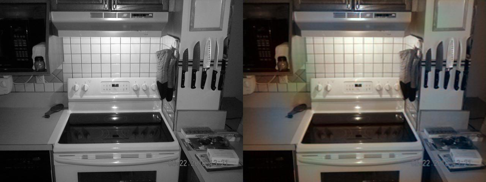

# 🎨 ImageColorization — Deep Learning Powered Photo Revitalization

[](https://www.python.org/downloads/)
[](https://pytorch.org/)
[](https://streamlit.io/)
[](LICENSE)

**ImageColorization** is a production-grade deep learning pipeline designed to breathe new life into black and white images. Using a state-of-the-art **Pix2Pix GAN architecture** (U-Net Generator + PatchGAN Discriminator) operating in the **CIE LAB color space**, it automatically predicts realistic chromaticity for grayscale inputs.

> Rediscover history in vibrant color. Perfect for old family photos, historical archives, and creative film projects.

---

## 🖼️ Results Gallery

Here is a glimpse of what the model can achieve at **Epoch 4**. For a full set of high-resolution comparisons, see the [Results Directory](results/README.md).

| Original (B&W) / Predicted Color | Scene Type |
|-----------------------------------|------------|
|  | Natural Landscapes |
|  | Indoor Textures |
|  | Complex Structural Details |

---

## ✨ Core Features

| Feature | Description |
|---------|-------------|
| 🖼️ **Intelligent Inference** | High-fidelity colorization for single images or complete directories. |
| 🌐 **Interactive Dashboard** | Professional Streamlit web app for real-time experimentation. |
| 📊 **Scientific Metrics** | Integrated PSNR and SSIM calculation for objective quality assessment. |
| 💾 **Advanced Checkpointing** | Robust save/load system for seamless training continuation. |
| 🚀 **Hardware Agnostic** | Optimized for CUDA, Apple Silicon (MPS), and ultra-optimized CPU fallback. |

---

## 🏗️ How It Works

The system utilizes a **Conditional Generative Adversarial Network (cGAN)** specialized for image-to-image translation.

### 1. The Color Space (LAB)
Unlike RGB, the **LAB color space** separates Lightness (L) from chromaticity (A and B). This is ideal for colorization because:
- The **L-channel** provides a perfect grayscale input.
- The model only needs to predict the 2-channel **ab** distribution, reducing complexity.

### 2. Architecture Details
- **Generator (U-Net)**: Uses symmetrical skip connections to pass high-frequency details from the encoder directly to the decoder, preventing blurriness.
- **Discriminator (PatchGAN)**: Instead of judging the whole image, it classifies whether each 30x30 patch is "real" or "fake", forcing the generator to produce sharp, local color borders.

---

## 🚀 Getting Started

### Installation

```bash
# 1. Clone the repository
git clone https://github.com/yourusername/ImageColorization.git
cd ImageColorization

# 2. Install core dependencies
pip install -r requirements.txt
```

### Usage

#### 🖥️ Web Interface (Recommended)
Launch the interactive dashboard to colorize images via drag-and-drop:
```bash
python -m streamlit run streamlit_app.py
```

#### ⌨️ Command Line
```bash
# Single image
python main.py --input photo.jpg --model model_checkpoint.pth --output result.jpg

# Batch process a folder
python main.py --input ./old_photos --model model_checkpoint.pth --output ./restored --batch
```

---

## 🛠️ Performance & Training

| Parameter | Value |
|-----------|-------|
| **Backbone** | ResNet-style U-Net |
| **Input Size** | 256 x 256 |
| **Dataset** | COCO Sample (2017) |
| **Inference Time** | ~40ms (GPU) / ~300ms (CPU) |

---

## 📝 Acknowledgments

- **Richard Zhang et al.** for the pioneering work on automatic colorization (ECCV 2016).
- **Phillip Isola et al.** for the Pix2Pix architecture (CVPR 2017).
- **FastAI Team** for the public COCO dataset samples.

---
<p align="center">
  <b>Developed by Gokul Sathishkumar — Bringing the past into the present.</b>
</p>
