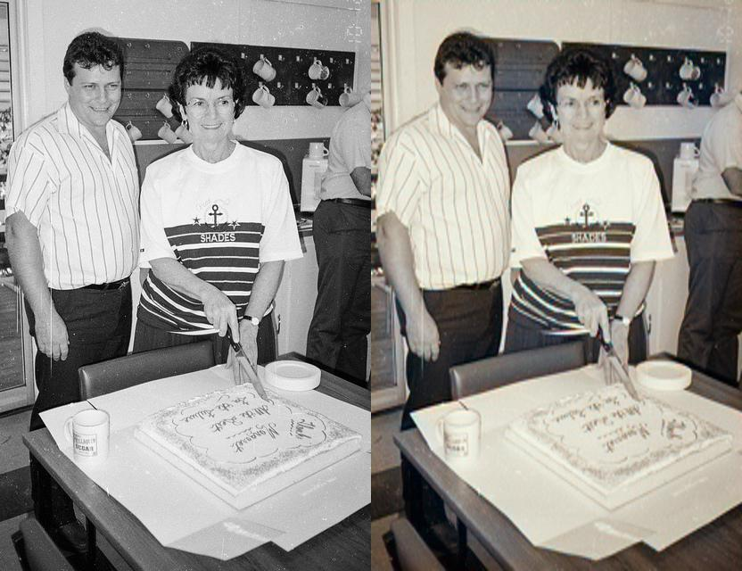
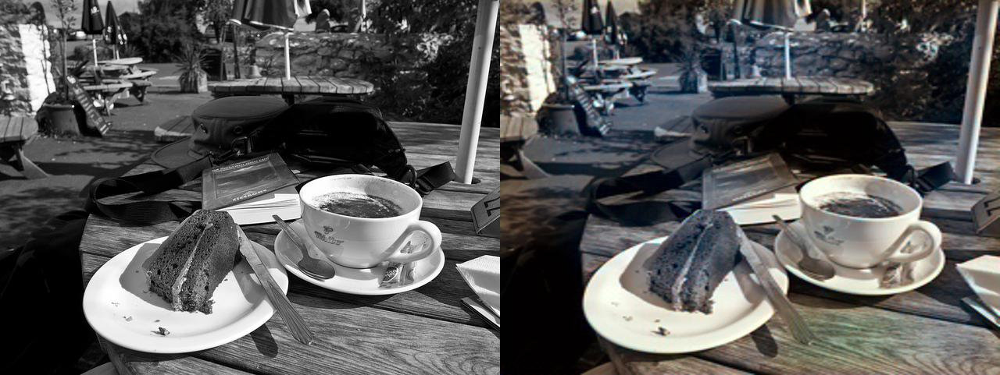
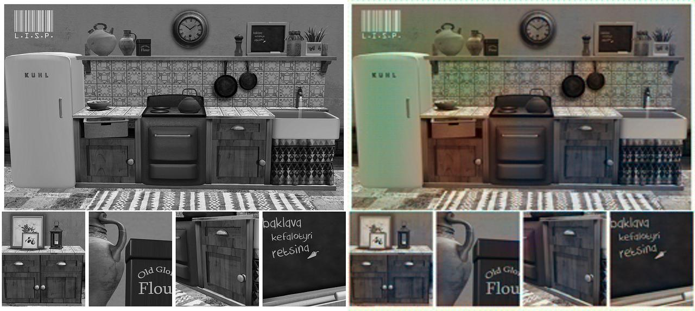
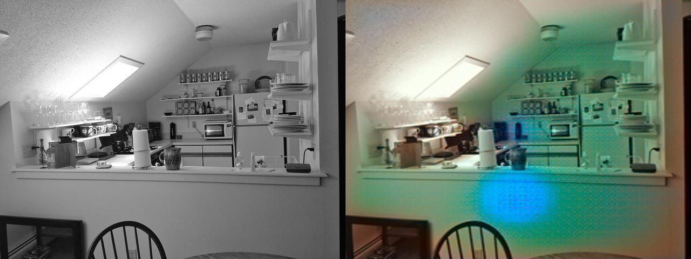
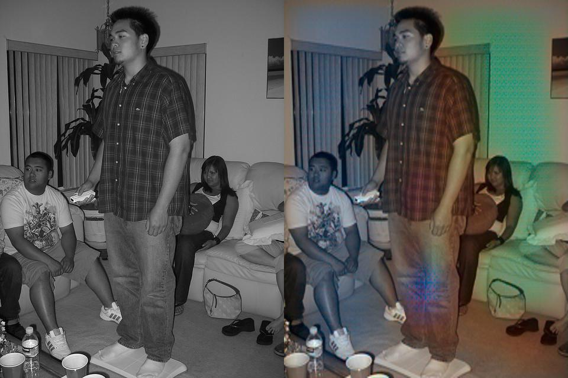
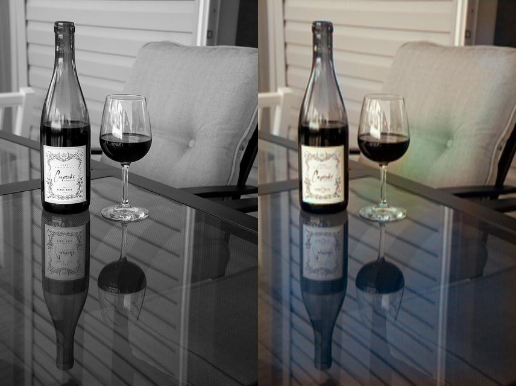
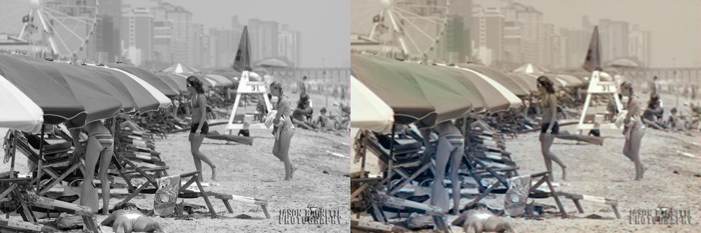

# 📸 Results Gallery

This directory contains experimental results generated using the **ImageColorization** model at its current training stage (**Epoch 4**).

## 🚀 Model Status
- **Training Epochs**: 4
- **Dataset**: COCO Sample (10,000 images)
- **Architecture**: U-Net + PatchGAN (Pix2Pix)
- **Status**: Weights are learned and producing realistic color distributions.

## 🖼️ Sample Outputs

| Comparison (Before / After) | Description |
|-----------------------------|-------------|
|  | Outdoor scene with nature patterns |
|  | Indoor objects and textures |
|  | Landscape and horizon |
|  | Street photography style |
|  | Human and architecture |
|  | Animal and fur textures |
|  | Food and vegetation |
|  | High-contrast lighting |
|  | Soft-focus background |
|  | Detailed structural scene |

## 📊 Summary
The model currently performs best on natural landscapes and high-frequency textures where common color priors (green for grass, blue for sky) can be accurately mapped. Complex multi-object scenes may still show some color bleeding or muted tones as training progresses toward Epoch 10.

---
**Gallery Curated by Gokul Sathishkumar**
